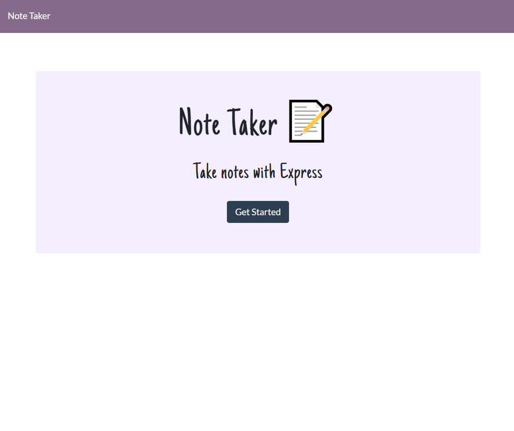
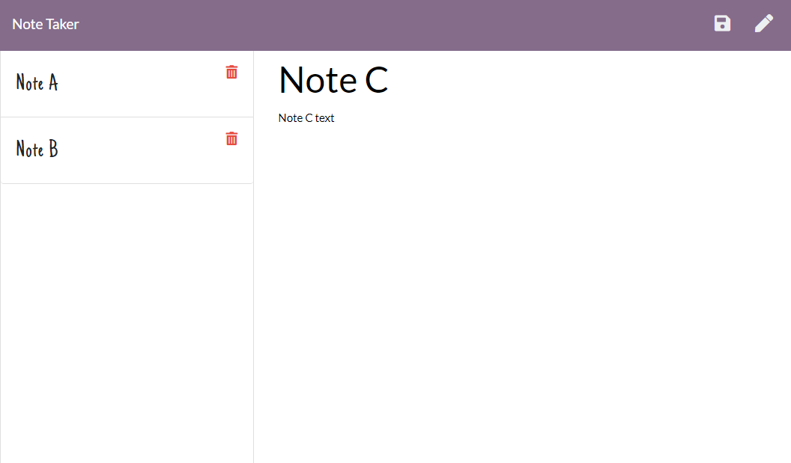

  # note-taker

   ## Table of Contents 
  * [Description](#-Description)
  * [Screenshots](#-Screenshots)
  * [Installation](#-Installation)
  * [Usage](#-Usage)
  * [License](#-License)
  * [Contributing](#-Contributing)
  * [Contact](#-Contact-Information)
  
  ## Description
  A note taker built with the Express library of Node.js. It will save, retrieve and delete notes created by the user.

  


  ## Screenshots
  





  ## Installation
  If you want to run a copy of this app on your local machine, first clone the repository:

HTTPS:
```
$ git clone https://github.com/azm89/note-taker.git
```

SSH:
```
$ git clone git@github.com:azm89/note-taker.git
```

Then cd/ into the cloned directory and download the dependencies by typing into the command line
```
$ npm install --save
```

Once the dependencies are installed, start the application by typing into the command line
```
$ node server.js
```

Then go to the browser and enter into the address bar
```
$ localhost:3001
```

  
  ## Usage
  Use this app to take notes you want saved.
  
  ## Contributing 
  If you wish to contribute to the project, please email me.
  
  ## Contact Information 
  * GitHub Username: azm89
  * Contact Email: ashtonmoore89@gmail.com
